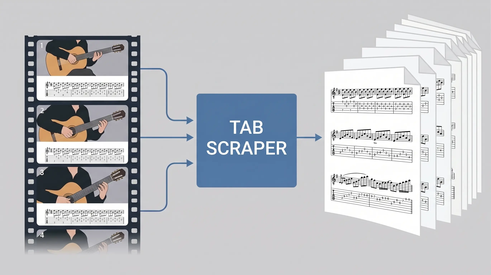

# yt-tab-scraper

Turn any YouTube guitar-tab video into a clean, printable PDF.

Works with tab-only videos, notation + tab panels. No manual cropping needed - the tool finds the six
evenly spaced lines that make tab *tab* and tracks them automatically.



## Setup

```sh
brew install ffmpeg
python3 -m venv .venv && .venv/bin/pip install -e .
brew install deno
```

## Usage

```sh
.venv/bin/tab-scraper "https://www.youtube.com/watch?v=..." -o out
```

Outputs in `out/`:

- `tab.pdf` - the tab strips, stacked in play order
- `crop_debug.png` - sample frame with the auto-detected strip region drawn in red.
  **Always check this**; wrong region → plausible-looking PDF of garbage.
- `strips/` - each kept strip as PNG (for tuning `--threshold`)
- `work/` - cached download + frames, reused on re-runs; delete to start fresh

Knobs when the defaults misbehave:

- `--start` / `--end` - only scan part of the video (seconds or `mm:ss`), e.g.
  `--start 2:10` when the tabs only appear in the second half
- `--crop x,y,w,h` - manual strip region if auto-detect fails (coords from `crop_debug.png`)
- `--threshold 0.06` - dedup sensitivity; raise if the same strip appears twice,
  lower if different strips get merged
- `--fps 1` - sampling rate; raise to 2 if very short strips get skipped
